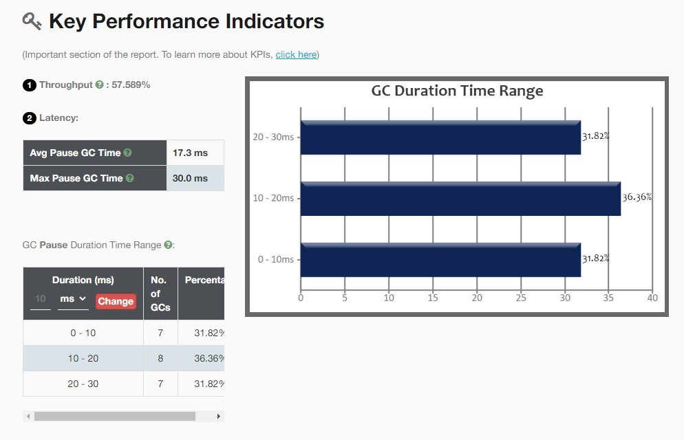
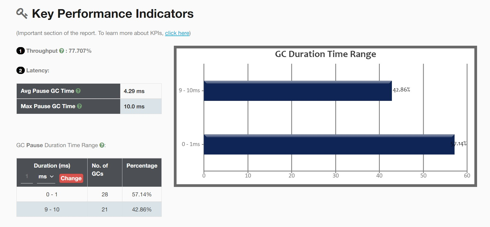

<h3>执行串行GC </h3> 
命令：java -XX:+UseSerialGC -Xmx1g -Xms1g -XX:+PrintGCDetails -XX:+PrintGCDateStamps -XX:-UseAdaptiveSizePolicy -Xloggc:SerialGC_1G.log  personalPractice.GarbageAnalyze
 

<

日志记录
 
Java HotSpot(TM) 64-Bit Server VM (25.291-b10) for windows-amd64 JRE (1.8.0_291-b10), built on Apr  9 2021 00:02:00 by "java_re" with MS VC++ 15.9 (VS2017) 
Memory: 4k page, physical 33465900k(21952992k free), swap 38446636k(23666336k free) 
CommandLine flags: -XX:InitialHeapSize=1073741824 -XX:MaxHeapSize=1073741824 -XX:+PrintGC -XX:+PrintGCDateStamps -XX:+PrintGCDetails -XX:+PrintGCTimeStamps -XX:-UseAdaptiveSizePolicy -XX:+UseCompressedClassPointers -XX:+UseCompressedOops -XX:-UseLargePagesIndividualAllocation -XX:+UseSerialGC  
2021-11-13T13:23:20.350+0900: 0.150: [GC (Allocation Failure) 2021-11-13T13:23:20.351+0900: 0.150: [DefNew: 279616K->34943K(314560K), 0.0238146 secs] 279616K->83208K(1013632K), 0.0240733 secs] [Times: user=0.00 sys=0.02, real=0.02 secs]  
2021-11-13T13:23:20.409+0900: 0.209: [GC (Allocation Failure) 2021-11-13T13:23:20.409+0900: 0.209: [DefNew: 314559K->34943K(314560K), 0.0295682 secs] 362824K->159639K(1013632K), 0.0296883 secs] [Times: user=0.02 sys=0.01, real=0.03 secs]  
2021-11-13T13:23:20.472+0900: 0.272: [GC (Allocation Failure) 2021-11-13T13:23:20.472+0900: 0.272: [DefNew: 314559K->34943K(314560K), 0.0249217 secs] 439255K->236826K(1013632K), 0.0250365 secs] [Times: user=0.00 sys=0.02, real=0.03 secs]  
2021-11-13T13:23:20.530+0900: 0.329: [GC (Allocation Failure) 2021-11-13T13:23:20.530+0900: 0.330: [DefNew: 314559K->34941K(314560K), 0.0244732 secs] 516442K->312197K(1013632K), 0.0245848 secs] [Times: user=0.03 sys=0.00, real=0.02 secs]  
2021-11-13T13:23:20.587+0900: 0.387: [GC (Allocation Failure) 2021-11-13T13:23:20.587+0900: 0.387: [DefNew: 314557K->34944K(314560K), 0.0263453 secs] 591813K->393581K(1013632K), 0.0264470 secs] [Times: user=0.00 sys=0.03, real=0.03 secs]  
2021-11-13T13:23:20.647+0900: 0.446: [GC (Allocation Failure) 2021-11-13T13:23:20.647+0900: 0.446: [DefNew: 314560K->34943K(314560K), 0.0264495 secs] 673197K->476108K(1013632K), 0.0265555 secs] [Times: user=0.03 sys=0.00, real=0.03 secs]  
2021-11-13T13:23:20.707+0900: 0.507: [GC (Allocation Failure) 2021-11-13T13:23:20.707+0900: 0.507: [DefNew: 314559K->34943K(314560K), 0.0259516 secs] 755724K->552947K(1013632K), 0.0260725 secs] [Times: user=0.02 sys=0.00, real=0.03 secs]  
2021-11-13T13:23:20.767+0900: 0.567: [GC (Allocation Failure) 2021-11-13T13:23:20.767+0900: 0.567: [DefNew: 314559K->34944K(314560K), 0.0272622 secs] 832563K->636635K(1013632K), 0.0273688 secs] [Times: user=0.00 sys=0.02, real=0.03 secs]  
2021-11-13T13:23:20.828+0900: 0.628: [GC (Allocation Failure) 2021-11-13T13:23:20.828+0900: 0.628: [DefNew: 314412K->314412K(314560K), 0.0000149 secs]2021-11-13T13:23:20.828+0900: 0.628: [Tenured: 601691K->371386K(699072K), 0.0430203 secs] 916104K->371386K(1013632K), [Metaspace: 2653K->2653K(1056768K)],  0.0431842 secs] [Times: user=0.05 sys=0.00, real=0.04 secs]  
2021-11-13T13:23:20.905+0900: 0.705: [GC (Allocation Failure) 2021-11-13T13:23:20.905+0900: 0.705: [DefNew: 279616K->34943K(314560K), 0.0111970 secs] 651002K->458379K(1013632K), 0.0113057 secs] [Times: user=0.01 sys=0.00, real=0.01 secs]  
2021-11-13T13:23:20.950+0900: 0.750: [GC (Allocation Failure) 2021-11-13T13:23:20.950+0900: 0.750: [DefNew: 314559K->34943K(314560K), 0.0144689 secs] 737995K->537689K(1013632K), 0.0145762 secs] [Times: user=0.02 sys=0.00, real=0.01 secs]  
2021-11-13T13:23:20.999+0900: 0.799: [GC (Allocation Failure) 2021-11-13T13:23:20.999+0900: 0.799: [DefNew: 314559K->34941K(314560K), 0.0137137 secs] 817305K->609507K(1013632K), 0.0138196 secs] [Times: user=0.02 sys=0.00, real=0.01 secs]  
2021-11-13T13:23:21.048+0900: 0.848: [GC (Allocation Failure) 2021-11-13T13:23:21.048+0900: 0.848: [DefNew: 314557K->34943K(314560K), 0.0218014 secs] 889123K->688531K(1013632K), 0.0219147 secs] [Times: user=0.00 sys=0.02, real=0.02 secs]  
2021-11-13T13:23:21.103+0900: 0.903: [GC (Allocation Failure) 2021-11-13T13:23:21.103+0900: 0.903: [DefNew: 314559K->314559K(314560K), 0.0000140 secs]2021-11-13T13:23:21.103+0900: 0.903: [Tenured: 653587K->400668K(699072K), 0.0473314 secs] 968147K->400668K(1013632K), [Metaspace: 2653K->2653K(1056768K)],  0.0474586 secs] [Times: user=0.05 sys=0.00, real=0.05 secs]  
2021-11-13T13:23:21.185+0900: 0.985: [GC (Allocation Failure) 2021-11-13T13:23:21.185+0900: 0.985: [DefNew: 279616K->34943K(314560K), 0.0108178 secs] 680284K->483988K(1013632K), 0.0109254 secs] [Times: user=0.02 sys=0.00, real=0.01 secs]  
2021-11-13T13:23:21.229+0900: 1.029: [GC (Allocation Failure) 2021-11-13T13:23:21.229+0900: 1.029: [DefNew: 314559K->34943K(314560K), 0.0143321 secs] 763604K->561975K(1013632K), 0.0144389 secs] [Times: user=0.02 sys=0.00, real=0.01 secs]  
Heap 
 def new generation   total 314560K, used 188452K [0x00000000c0000000, 0x00000000d5550000, 0x00000000d5550000) 
  eden space 279616K,  54% used [0x00000000c0000000, 0x00000000c95e93a8, 0x00000000d1110000) 
  from space 34944K,  99% used [0x00000000d1110000, 0x00000000d332fe80, 0x00000000d3330000) 
  to   space 34944K,   0% used [0x00000000d3330000, 0x00000000d3330000, 0x00000000d5550000) 
 tenured generation   total 699072K, used 527031K [0x00000000d5550000, 0x0000000100000000, 0x0000000100000000) 
   the space 699072K,  75% used [0x00000000d5550000, 0x00000000f57fdef0, 0x00000000f57fe000, 0x0000000100000000) 
 Metaspace       used 2659K, capacity 4486K, committed 4864K, reserved 1056768K 
  class space    used 291K, capacity 386K, committed 512K, reserved 1048576K 

 
 
 

<h3>执行并行GC </h3> 

java -XX:+UseParallelGC -Xmx1g -Xms1g -XX:+PrintGCDetails -XX:+PrintGCDateStamps -XX:-UseAdaptiveSizePolicy -Xloggc:ParallelGC_1G.log  personalPractice.GarbageAnalyze

 
日志
 

<)>

Java HotSpot(TM) 64-Bit Server VM (25.291-b10) for windows-amd64 JRE (1.8.0_291-b10), built on Apr  9 2021 00:02:00 by "java_re" with MS VC++ 15.9 (VS2017) 
Memory: 4k page, physical 33465900k(22004732k free), swap 38446636k(23764644k free) 
CommandLine flags: -XX:InitialHeapSize=1073741824 -XX:MaxHeapSize=1073741824 -XX:+PrintGC -XX:+PrintGCDateStamps -XX:+PrintGCDetails -XX:+PrintGCTimeStamps -XX:-UseAdaptiveSizePolicy -XX:+UseCompressedClassPointers -XX:+UseCompressedOops -XX:-UseLargePagesIndividualAllocation -XX:+UseParallelGC  
2021-11-13T13:27:20.923+0900: 0.152: [GC (Allocation Failure) [PSYoungGen: 262144K->43510K(305664K)] 262144K->83171K(1005056K), 0.0166041 secs]==} [Times: user=0.08 sys=0.20, real=0.02 secs]  
2021-11-13T13:27:20.974+0900: 0.203: [GC (Allocation Failure) [PSYoungGen: 305654K->43508K(305664K)] 345315K->159774K(1005056K), 0.0234789 secs] [Times: user=0.02 sys=0.27, real=0.02 secs]  
2021-11-13T13:27:21.030+0900: 0.259: [GC (Allocation Failure) [PSYoungGen: 305652K->43511K(305664K)] 421918K->229871K(1005056K), 0.0191341 secs] [Times: user=0.30 sys=0.27, real=0.02 secs]  
2021-11-13T13:27:21.083+0900: 0.312: [GC (Allocation Failure) [PSYoungGen: 305655K->43512K(305664K)] 492015K->300739K(1005056K), 0.0195555 secs] [Times: user=0.02 sys=0.26, real=0.02 secs]  
2021-11-13T13:27:21.136+0900: 0.365: [GC (Allocation Failure) [PSYoungGen: 305656K->43509K(305664K)] 562883K->377628K(1005056K), 0.0204272 secs] [Times: user=0.00 sys=0.28, real=0.02 secs]  
2021-11-13T13:27:21.189+0900: 0.419: [GC (Allocation Failure) [PSYoungGen: 305479K->43518K(305664K)] 639598K->442317K(1005056K), 0.0184260 secs] [Times: user=0.03 sys=0.25, real=0.02 secs]  
2021-11-13T13:27:21.241+0900: 0.470: [GC (Allocation Failure) [PSYoungGen: 305568K->43504K(305664K)] 704368K->514341K(1005056K), 0.0198556 secs] [Times: user=0.02 sys=0.25, real=0.02 secs]  
2021-11-13T13:27:21.294+0900: 0.523: [GC (Allocation Failure) [PSYoungGen: 305648K->43510K(305664K)] 776485K->579172K(1005056K), 0.0183404 secs] [Times: user=0.28 sys=0.00, real=0.02 secs]  
2021-11-13T13:27:21.346+0900: 0.575: [GC (Allocation Failure) [PSYoungGen: 305654K->43513K(305664K)] 841316K->658931K(1005056K), 0.0212131 secs] [Times: user=0.02 sys=0.27, real=0.02 secs]  
2021-11-13T13:27:21.367+0900: 0.597: [Full GC (Ergonomics) [PSYoungGen: 43513K->0K(305664K)] [ParOldGen: 615418K->327342K(699392K)] 658931K->327342K(1005056K), [Metaspace: 2653K->2653K(1056768K)],  0.0453081 secs] [Times: user=0.80 sys=0.05, real=0.05 secs]  
2021-11-13T13:27:21.444+0900: 0.674: [GC (Allocation Failure) [PSYoungGen: 262144K->43508K(305664K)] 589486K->413131K(1005056K), 0.0108879 secs] [Times: user=0.28 sys=0.00, real=0.01 secs]  
2021-11-13T13:27:21.488+0900: 0.717: [GC (Allocation Failure) [PSYoungGen: 305652K->43515K(305664K)] 675275K->479628K(1005056K), 0.0134397 secs] [Times: user=0.26 sys=0.00, real=0.01 secs]  
2021-11-13T13:27:21.535+0900: 0.764: [GC (Allocation Failure) [PSYoungGen: 305659K->43505K(305664K)] 741772K->550004K(1005056K), 0.0137914 secs] [Times: user=0.28 sys=0.00, real=0.01 secs]  
2021-11-13T13:27:21.581+0900: 0.811: [GC (Allocation Failure) [PSYoungGen: 305649K->43508K(305664K)] 812148K->630841K(1005056K), 0.0151060 secs] [Times: user=0.28 sys=0.00, real=0.02 secs]  
2021-11-13T13:27:21.630+0900: 0.859: [GC (Allocation Failure) [PSYoungGen: 305652K->43501K(305664K)] 892985K->701127K(1005056K), 0.0172336 secs] [Times: user=0.05 sys=0.23, real=0.02 secs]  
2021-11-13T13:27:21.647+0900: 0.876: [Full GC (Ergonomics) [PSYoungGen: 43501K->0K(305664K)] [ParOldGen: 657625K->367007K(699392K)] 701127K->367007K(1005056K), [Metaspace: 2653K->2653K(1056768K)],  0.0460473 secs] [Times: user=0.84 sys=0.00, real=0.05 secs]  
2021-11-13T13:27:21.724+0900: 0.954: [GC (Allocation Failure) [PSYoungGen: 262144K->43501K(305664K)] 629151K->449148K(1005056K), 0.0105785 secs] [Times: user=0.28 sys=0.00, real=0.01 secs]  
2021-11-13T13:27:21.768+0900: 0.997: [GC (Allocation Failure) [PSYoungGen: 305645K->43511K(305664K)] 711292K->523013K(1005056K), 0.0142730 secs] [Times: user=0.26 sys=0.00, real=0.01 secs]  
2021-11-13T13:27:21.815+0900: 1.044: [GC (Allocation Failure) [PSYoungGen: 305628K->43519K(305664K)] 785130K->599210K(1005056K), 0.0148665 secs] [Times: user=0.28 sys=0.00, real=0.01 secs]  
Heap 
 PSYoungGen      total 305664K, used 91164K [0x00000000eab00000, 0x0000000100000000, 0x0000000100000000) 
  eden space 262144K, 18% used [0x00000000eab00000,0x00000000ed987420,0x00000000fab00000) 
  from space 43520K, 99% used [0x00000000fab00000,0x00000000fd57ff60,0x00000000fd580000) 
  to   space 43520K, 0% used [0x00000000fd580000,0x00000000fd580000,0x0000000100000000) 
 ParOldGen       total 699392K, used 555690K [0x00000000c0000000, 0x00000000eab00000, 0x00000000eab00000) 
  object space 699392K, 79% used [0x00000000c0000000,0x00000000e1eaaa68,0x00000000eab00000) 
 Metaspace       used 2659K, capacity 4486K, committed 4864K, reserved 1056768K 
  class space    used 291K, capacity 386K, committed 512K, reserved 1048576K 

 
<h3>执行CMSGC</h3>
java -XX:+UseConcMarkSweepGC -Xmx1g -Xms1g -XX:+PrintGCDetails -XX:+PrintGCDateStamps -XX:-UseAdaptiveSizePolicy -Xloggc:CMSGC_1G.log  personalPractice.GarbageAnalyze

 

<>

Java HotSpot(TM) 64-Bit Server VM (25.291-b10) for windows-amd64 JRE (1.8.0_291-b10), built on Apr  9 2021 00:02:00 by "java_re" with MS VC++ 15.9 (VS2017) 
Memory: 4k page, physical 33465900k(21716376k free), swap 38446636k(23325392k free) 
CommandLine flags: -XX:InitialHeapSize=1073741824 -XX:MaxHeapSize=1073741824 -XX:MaxNewSize=357916672 -XX:MaxTenuringThreshold=6 -XX:NewSize=357916672 -XX:OldPLABSize=16 -XX:OldSize=715825152 -XX:+PrintGC -XX:+PrintGCDateStamps -XX:+PrintGCDetails -XX:+PrintGCTimeStamps -XX:-UseAdaptiveSizePolicy -XX:+UseCompressedClassPointers -XX:+UseCompressedOops -XX:+UseConcMarkSweepGC -XX:-UseLargePagesIndividualAllocation -XX:+UseParNewGC  
2021-11-13T14:08:17.729+0900: 0.164: [GC (Allocation Failure) 2021-11-13T14:08:17.729+0900: 0.164: [ParNew: 279616K->34944K(314560K),  0.0184808  secs] 279616K->87176K(1013632K),  0.0187370  secs] [Times: user=0.06 sys=0.22, real=0.02  secs]  
2021-11-13T14:08:17.785+0900: 0.220: [GC (Allocation Failure) 2021-11-13T14:08:17.785+0900: 0.220: [ParNew: 314560K->34944K(314560K),  0.0243209  secs] 366792K->167154K(1013632K),  0.0244055  secs] [Times: user=0.03 sys=0.25, real=0.02  secs]  
2021-11-13T14:08:17.844+0900: 0.279: [GC (Allocation Failure) 2021-11-13T14:08:17.844+0900: 0.279: [ParNew: 314560K->34943K(314560K),  0.0303337  secs] 446770K->250130K(1013632K),  0.0304150  secs] [Times: user=0.56 sys=0.00, real=0.03  secs]  
2021-11-13T14:08:17.910+0900: 0.345: [GC (Allocation Failure) 2021-11-13T14:08:17.910+0900: 0.345: [ParNew: 314559K->34943K(314560K),  0.0287167  secs] 529746K->327429K(1013632K),  0.0288047  secs] [Times: user=0.25 sys=0.03, real=0.03  secs]  
2021-11-13T14:08:17.973+0900: 0.408: [GC (Allocation Failure) 2021-11-13T14:08:17.973+0900: 0.408: [ParNew: 314559K->34943K(314560K),  0.0273154  secs] 607045K->405533K(1013632K),  0.0274297  secs] [Times: user=0.28 sys=0.01, real=0.03  secs]  
2021-11-13T14:08:18.001+0900: 0.436: [GC (CMS Initial Mark) [1 CMS-initial-mark: 370589K(699072K)] 411266K(1013632K),  0.0001587  secs] [Times: user=0.00 sys=0.00, real=0.00  secs]  
2021-11-13T14:08:18.001+0900: 0.436: [CMS-concurrent-mark-start] 
2021-11-13T14:08:18.003+0900: 0.438: [CMS-concurrent-mark: 0.002/0.002  secs] [Times: user=0.00 sys=0.00, real=0.00  secs]  
2021-11-13T14:08:18.003+0900: 0.438: [CMS-concurrent-preclean-start] 
2021-11-13T14:08:18.003+0900: 0.439: [CMS-concurrent-preclean: 0.001/0.001  secs] [Times: user=0.00 sys=0.00, real=0.00  secs]  
2021-11-13T14:08:18.003+0900: 0.439: [CMS-concurrent-abortable-preclean-start] 
2021-11-13T14:08:18.035+0900: 0.471: [GC (Allocation Failure) 2021-11-13T14:08:18.035+0900: 0.471: [ParNew: 314541K->34942K(314560K),  0.0271779  secs] 685131K->482753K(1013632K),  0.0272593  secs] [Times: user=0.27 sys=0.02, real=0.03  secs]  
2021-11-13T14:08:18.097+0900: 0.533: [GC (Allocation Failure) 2021-11-13T14:08:18.097+0900: 0.533: [ParNew: 314558K->34943K(314560K),  0.0292543  secs] 762369K->564599K(1013632K),  0.0293660  secs] [Times: user=0.51 sys=0.05, real=0.03  secs]  
2021-11-13T14:08:18.163+0900: 0.598: [GC (Allocation Failure) 2021-11-13T14:08:18.163+0900: 0.598: [ParNew: 314559K->34943K(314560K),  0.0285640  secs] 844215K->641853K(1013632K),  0.0286797  secs] [Times: user=0.55 sys=0.02, real=0.03  secs]  
2021-11-13T14:08:18.226+0900: 0.661: [GC (Allocation Failure) 2021-11-13T14:08:18.226+0900: 0.661: [ParNew: 314559K->34943K(314560K),  0.0269330  secs] 921469K->714948K(1013632K),  0.0270163  secs] [Times: user=0.56 sys=0.00, real=0.03  secs]  
2021-11-13T14:08:18.253+0900: 0.688: [CMS-concurrent-abortable-preclean: 0.005/0.250  secs] [Times: user=2.05 sys=0.08, real=0.25  secs]  
2021-11-13T14:08:18.253+0900: 0.688: [GC (CMS Final Remark) [YG occupancy: 40895 K (314560 K)]2021-11-13T14:08:18.253+0900: 0.688: [Rescan (parallel) ,  0.0003839  secs]2021-11-13T14:08:18.254+0900: 0.689: [weak refs processing,  0.0000112  secs]2021-11-13T14:08:18.254+0900: 0.689: [class unloading,  0.0002343  secs]2021-11-13T14:08:18.254+0900: 0.689: [scrub symbol table,  0.0003811  secs]2021-11-13T14:08:18.254+0900: 0.689: [scrub string table,  0.0000870  secs][1 CMS-remark: 680004K(699072K)] 720900K(1013632K),  0.0011588  secs] [Times: user=0.00 sys=0.00, real=0.00  secs]  
2021-11-13T14:08:18.254+0900: 0.690: [CMS-concurrent-sweep-start] 
2021-11-13T14:08:18.256+0900: 0.691: [CMS-concurrent-sweep: 0.001/0.001  secs] [Times: user=0.00 sys=0.00, real=0.00  secs]  
2021-11-13T14:08:18.256+0900: 0.691: [CMS-concurrent-reset-start] 
2021-11-13T14:08:18.257+0900: 0.692: [CMS-concurrent-reset: 0.001/0.001  secs] [Times: user=0.00 sys=0.00, real=0.00  secs]  
2021-11-13T14:08:18.290+0900: 0.725: [GC (Allocation Failure) 2021-11-13T14:08:18.290+0900: 0.725: [ParNew: 314559K->34942K(314560K),  0.0148836  secs] 851440K->643328K(1013632K),  0.0149420  secs] [Times: user=0.28 sys=0.00, real=0.02  secs]  
2021-11-13T14:08:18.305+0900: 0.740: [GC (CMS Initial Mark) [1 CMS-initial-mark: 608385K(699072K)] 649107K(1013632K),  0.0001756  secs] [Times: user=0.00 sys=0.00, real=0.00  secs]  
2021-11-13T14:08:18.305+0900: 0.740: [CMS-concurrent-mark-start] 
2021-11-13T14:08:18.306+0900: 0.741: [CMS-concurrent-mark: 0.001/0.001  secs] [Times: user=0.00 sys=0.00, real=0.00  secs]  
2021-11-13T14:08:18.306+0900: 0.741: [CMS-concurrent-preclean-start] 
2021-11-13T14:08:18.307+0900: 0.742: [CMS-concurrent-preclean: 0.001/0.001  secs] [Times: user=0.00 sys=0.00, real=0.00  secs]  
2021-11-13T14:08:18.307+0900: 0.742: [CMS-concurrent-abortable-preclean-start] 
2021-11-13T14:08:18.341+0900: 0.776: [GC (Allocation Failure) 2021-11-13T14:08:18.341+0900: 0.776: [ParNew: 314558K->34942K(314560K),  0.0188802  secs] 922944K->728378K(1013632K),  0.0189842  secs] [Times: user=0.30 sys=0.00, real=0.02  secs]  
2021-11-13T14:08:18.360+0900: 0.795: [CMS-concurrent-abortable-preclean: 0.001/0.053  secs] [Times: user=0.33 sys=0.00, real=0.05  secs]  
2021-11-13T14:08:18.360+0900: 0.795: [GC (CMS Final Remark) [YG occupancy: 41165 K (314560 K)]2021-11-13T14:08:18.360+0900: 0.795: [Rescan (parallel) ,  0.0003153  secs]2021-11-13T14:08:18.360+0900: 0.796: [weak refs processing,  0.0000130  secs]2021-11-13T14:08:18.360+0900: 0.796: [class unloading,  0.0002476  secs]2021-11-13T14:08:18.361+0900: 0.796: [scrub symbol table,  0.0004555  secs]2021-11-13T14:08:18.361+0900: 0.796: [scrub string table,  0.0001017  secs][1 CMS-remark: 693436K(699072K)] 734601K(1013632K),  0.0012038  secs] [Times: user=0.00 sys=0.00, real=0.00  secs]  
2021-11-13T14:08:18.361+0900: 0.796: [CMS-concurrent-sweep-start] 
2021-11-13T14:08:18.363+0900: 0.798: [CMS-concurrent-sweep: 0.002/0.002  secs] [Times: user=0.00 sys=0.00, real=0.00  secs]  
2021-11-13T14:08:18.363+0900: 0.798: [CMS-concurrent-reset-start] 
2021-11-13T14:08:18.364+0900: 0.800: [CMS-concurrent-reset: 0.001/0.001  secs] [Times: user=0.00 sys=0.00, real=0.00  secs]  
2021-11-13T14:08:18.396+0900: 0.832: [GC (Allocation Failure) 2021-11-13T14:08:18.396+0900: 0.832: [ParNew: 314558K->34943K(314560K),  0.0154745  secs] 693695K->489974K(1013632K),  0.0155962  secs] [Times: user=0.28 sys=0.00, real=0.02  secs]  
2021-11-13T14:08:18.412+0900: 0.847: [GC (CMS Initial Mark) [1 CMS-initial-mark: 455031K(699072K)] 490200K(1013632K),  0.0001689  secs] [Times: user=0.00 sys=0.00, real=0.00  secs]  
2021-11-13T14:08:18.412+0900: 0.847: [CMS-concurrent-mark-start] 
2021-11-13T14:08:18.413+0900: 0.848: [CMS-concurrent-mark: 0.001/0.001  secs] [Times: user=0.00 sys=0.00, real=0.00  secs]  
2021-11-13T14:08:18.413+0900: 0.848: [CMS-concurrent-preclean-start] 
2021-11-13T14:08:18.414+0900: 0.849: [CMS-concurrent-preclean: 0.001/0.001  secs] [Times: user=0.00 sys=0.00, real=0.00  secs]  
2021-11-13T14:08:18.414+0900: 0.849: [CMS-concurrent-abortable-preclean-start] 
2021-11-13T14:08:18.448+0900: 0.883: [GC (Allocation Failure) 2021-11-13T14:08:18.448+0900: 0.883: [ParNew: 314559K->34943K(314560K),  0.0164286  secs] 769590K->566932K(1013632K),  0.0165667  secs] [Times: user=0.28 sys=0.00, real=0.02  secs]  
2021-11-13T14:08:18.500+0900: 0.935: [GC (Allocation Failure) 2021-11-13T14:08:18.500+0900: 0.936: [ParNew: 314559K->34943K(314560K),  0.0159097  secs] 846548K->643706K(1013632K),  0.0160318  secs] [Times: user=0.28 sys=0.00, real=0.02  secs]  
2021-11-13T14:08:18.555+0900: 0.990: [GC (Allocation Failure) 2021-11-13T14:08:18.555+0900: 0.990: [ParNew: 314559K->34943K(314560K),  0.0153932  secs] 923322K->716905K(1013632K),  0.0155262  secs] [Times: user=0.28 sys=0.00, real=0.01  secs]  
2021-11-13T14:08:18.570+0900: 1.006: [CMS-concurrent-abortable-preclean: 0.004/0.157  secs] [Times: user=0.97 sys=0.00, real=0.16  secs]  
2021-11-13T14:08:18.571+0900: 1.006: [GC (CMS Final Remark) [YG occupancy: 40753 K (314560 K)]2021-11-13T14:08:18.571+0900: 1.006: [Rescan (parallel) ,  0.0003318  secs]2021-11-13T14:08:18.571+0900: 1.006: [weak refs processing,  0.0000092  secs]2021-11-13T14:08:18.571+0900: 1.006: [class unloading,  0.0002194  secs]2021-11-13T14:08:18.571+0900: 1.006: [scrub symbol table,  0.0004148  secs]2021-11-13T14:08:18.572+0900: 1.007: [scrub string table,  0.0000875  secs][1 CMS-remark: 681962K(699072K)] 722715K(1013632K),  0.0011154  secs] [Times: user=0.00 sys=0.00, real=0.00  secs]  
2021-11-13T14:08:18.572+0900: 1.007: [CMS-concurrent-sweep-start] 
2021-11-13T14:08:18.573+0900: 1.009: [CMS-concurrent-sweep: 0.002/0.002  secs] [Times: user=0.00 sys=0.00, real=0.00  secs]  
2021-11-13T14:08:18.573+0900: 1.009: [CMS-concurrent-reset-start] 
2021-11-13T14:08:18.574+0900: 1.010: [CMS-concurrent-reset: 0.001/0.001  secs] [Times: user=0.00 sys=0.00, real=0.00  secs]  
2021-11-13T14:08:18.607+0900: 1.042: [GC (Allocation Failure) 2021-11-13T14:08:18.607+0900: 1.042: [ParNew: 314559K->34942K(314560K),  0.0154719  secs] 849960K->647126K(1013632K),  0.0155698  secs] [Times: user=0.28 sys=0.00, real=0.02  secs]  
2021-11-13T14:08:18.623+0900: 1.058: [GC (CMS Initial Mark) [1 CMS-initial-mark: 612184K(699072K)] 647525K(1013632K),  0.0001898  secs] [Times: user=0.00 sys=0.00, real=0.00  secs]  
2021-11-13T14:08:18.623+0900: 1.058: [CMS-concurrent-mark-start] 
2021-11-13T14:08:18.624+0900: 1.059: [CMS-concurrent-mark: 0.001/0.001  secs] [Times: user=0.00 sys=0.00, real=0.00  secs]  
2021-11-13T14:08:18.624+0900: 1.059: [CMS-concurrent-preclean-start] 
2021-11-13T14:08:18.625+0900: 1.060: [CMS-concurrent-preclean: 0.001/0.001  secs] [Times: user=0.00 sys=0.00, real=0.00  secs]  
2021-11-13T14:08:18.625+0900: 1.060: [CMS-concurrent-abortable-preclean-start] 
Heap 
 par new generation   total 314560K, used 91441K [0x00000000c0000000, 0x00000000d5550000, 0x00000000d5550000) 
  eden space 279616K,  20% used [0x00000000c0000000, 0x00000000c372cb98, 0x00000000d1110000) 
  from space 34944K,  99% used [0x00000000d1110000, 0x00000000d332f8d0, 0x00000000d3330000) 
  to   space 34944K,   0% used [0x00000000d3330000, 0x00000000d3330000, 0x00000000d5550000) 
 concurrent mark-sweep generation total 699072K, used 612184K [0x00000000d5550000, 0x0000000100000000, 0x0000000100000000) 
 Metaspace       used 2659K, capacity 4486K, committed 4864K, reserved 1056768K 
  class space    used 291K, capacity 386K, committed 512K, reserved 1048576K 

 
<h3>执行G1GC</h3>

java -XX:+UseG1GC -Xmx1g -Xms1g -XX:+PrintGC -XX:+PrintGCDateStamps -XX:-UseAdaptiveSizePolicy -Xloggc:G1GC_1G.log  personalPractice.GarbageAnalyze
 

日志
 

<>

Java HotSpot(TM) 64-Bit Server VM (25.291-b10) for windows-amd64 JRE (1.8.0_291-b10), built on Apr  9 2021 00:02:00 by "java_re" with MS VC++ 15.9 (VS2017)  
Memory: 4k page, physical 33465900k(21669560k free), swap 38446636k(23243988k free)  
CommandLine flags: -XX:InitialHeapSize=1073741824 -XX:MaxHeapSize=1073741824 -XX:+PrintGC -XX:+PrintGCDateStamps -XX:+PrintGCTimeStamps -XX:-UseAdaptiveSizePolicy -XX:+UseCompressedClassPointers -XX:+UseCompressedOops -XX:+UseG1GC -XX:-UseLargePagesIndividualAllocation   
2021-11-13T14:23:07.661+0900: 0.103: [GC pause (G1 Evacuation Pause) (young) 66M->28M(1024M),  0.0049363  secs]  
2021-11-13T14:23:07.676+0900: 0.118: [GC pause (G1 Evacuation Pause) (young) 82M->49M(1024M),  0.0048500  secs]  
2021-11-13T14:23:07.693+0900: 0.135: [GC pause (G1 Evacuation Pause) (young) 108M->71M(1024M),  0.0052384  secs]  
2021-11-13T14:23:07.708+0900: 0.150: [GC pause (G1 Evacuation Pause) (young) 133M->93M(1024M),  0.0064594  secs]  
2021-11-13T14:23:07.735+0900: 0.177: [GC pause (G1 Evacuation Pause) (young) 187M->126M(1024M),  0.0085508  secs]  
2021-11-13T14:23:07.767+0900: 0.209: [GC pause (G1 Evacuation Pause) (young) 240M->166M(1024M),  0.0091735  secs]  
2021-11-13T14:23:07.838+0900: 0.280: [GC pause (G1 Evacuation Pause) (young) 444M->241M(1024M),  0.0161707  secs]  
2021-11-13T14:23:07.878+0900: 0.320: [GC pause (G1 Evacuation Pause) (young) 425M->290M(1024M),  0.0122099  secs]  
2021-11-13T14:23:07.931+0900: 0.373: [GC pause (G1 Evacuation Pause) (young) 572M->360M(1024M),  0.0152669  secs]  
2021-11-13T14:23:07.981+0900: 0.423: [GC pause (G1 Humongous Allocation) (young) (initial-mark) 627M->422M(1024M),  0.0142269  secs]  
2021-11-13T14:23:07.996+0900: 0.437: [GC concurrent-root-region-scan-start]  
2021-11-13T14:23:07.996+0900: 0.438: [GC concurrent-root-region-scan-end,  0.0001561  secs]  
2021-11-13T14:23:07.996+0900: 0.438: [GC concurrent-mark-start]  
2021-11-13T14:23:07.997+0900: 0.439: [GC concurrent-mark-end,  0.0012652  secs]  
2021-11-13T14:23:07.997+0900: 0.439: [GC remark,  0.0012913  secs]  
2021-11-13T14:23:07.998+0900: 0.440: [GC cleanup 436M->424M(1024M),  0.0011005  secs]  
2021-11-13T14:23:08.000+0900: 0.441: [GC concurrent-cleanup-start]  
2021-11-13T14:23:08.000+0900: 0.442: [GC concurrent-cleanup-end,  0.0000191  secs]  
2021-11-13T14:23:08.074+0900: 0.516: [GC pause (G1 Evacuation Pause) (young)-- 843M->645M(1024M),  0.0147360  secs]  
2021-11-13T14:23:08.090+0900: 0.532: [GC pause (G1 Evacuation Pause) (mixed) 651M->566M(1024M),  0.0083752  secs]  
2021-11-13T14:23:08.099+0900: 0.540: [GC pause (G1 Humongous Allocation) (young) (initial-mark) 569M->567M(1024M),  0.0014545  secs]  
2021-11-13T14:23:08.100+0900: 0.542: [GC concurrent-root-region-scan-start]  
2021-11-13T14:23:08.100+0900: 0.542: [GC concurrent-root-region-scan-end,  0.0000956  secs]  
2021-11-13T14:23:08.100+0900: 0.542: [GC concurrent-mark-start]  
2021-11-13T14:23:08.101+0900: 0.543: [GC concurrent-mark-end,  0.0013612  secs]  
2021-11-13T14:23:08.102+0900: 0.544: [GC remark,  0.0012135  secs]  
2021-11-13T14:23:08.103+0900: 0.545: [GC cleanup 581M->578M(1024M),  0.0009896  secs]  
2021-11-13T14:23:08.104+0900: 0.546: [GC concurrent-cleanup-start]  
2021-11-13T14:23:08.104+0900: 0.546: [GC concurrent-cleanup-end,  0.0000096  secs]  
2021-11-13T14:23:08.143+0900: 0.585: [GC pause (G1 Evacuation Pause) (young)-- 872M->718M(1024M),  0.0087611  secs]  
2021-11-13T14:23:08.155+0900: 0.597: [GC pause (G1 Evacuation Pause) (mixed) 744M->624M(1024M),  0.0063396  secs]  
2021-11-13T14:23:08.170+0900: 0.611: [GC pause (G1 Evacuation Pause) (mixed) 686M->556M(1024M),  0.0063943  secs]  
2021-11-13T14:23:08.183+0900: 0.625: [GC pause (G1 Evacuation Pause) (mixed) 610M->537M(1024M),  0.0054378  secs]  
2021-11-13T14:23:08.190+0900: 0.632: [GC pause (G1 Humongous Allocation) (young) (initial-mark) 546M->538M(1024M),  0.0020738  secs]  
2021-11-13T14:23:08.192+0900: 0.634: [GC concurrent-root-region-scan-start]  
2021-11-13T14:23:08.192+0900: 0.634: [GC concurrent-root-region-scan-end,  0.0000607  secs]  
2021-11-13T14:23:08.192+0900: 0.634: [GC concurrent-mark-start]  
2021-11-13T14:23:08.194+0900: 0.636: [GC concurrent-mark-end,  0.0015501  secs]  
2021-11-13T14:23:08.194+0900: 0.636: [GC remark,  0.0130868  secs]  
2021-11-13T14:23:08.207+0900: 0.649: [GC cleanup 550M->529M(1024M),  0.0009560  secs]  
2021-11-13T14:23:08.208+0900: 0.650: [GC concurrent-cleanup-start]  
2021-11-13T14:23:08.208+0900: 0.650: [GC concurrent-cleanup-end,  0.0000262  secs]  
2021-11-13T14:23:08.248+0900: 0.690: [GC pause (G1 Evacuation Pause) (young)-- 851M->635M(1024M),  0.0105782  secs]  
2021-11-13T14:23:08.261+0900: 0.703: [GC pause (G1 Evacuation Pause) (mixed) 656M->550M(1024M),  0.0077787  secs]  
2021-11-13T14:23:08.276+0900: 0.718: [GC pause (G1 Evacuation Pause) (mixed) 606M->513M(1024M),  0.0071322  secs]  
2021-11-13T14:23:08.283+0900: 0.725: [GC pause (G1 Humongous Allocation) (young) (initial-mark) 514M->512M(1024M),  0.0020639  secs]  
2021-11-13T14:23:08.285+0900: 0.727: [GC concurrent-root-region-scan-start]  
2021-11-13T14:23:08.285+0900: 0.727: [GC concurrent-root-region-scan-end,  0.0000654  secs]  
2021-11-13T14:23:08.285+0900: 0.728: [GC concurrent-mark-start]  
2021-11-13T14:23:08.287+0900: 0.729: [GC concurrent-mark-end,  0.0013839  secs]  
2021-11-13T14:23:08.287+0900: 0.729: [GC remark,  0.0013637  secs]  
2021-11-13T14:23:08.288+0900: 0.730: [GC cleanup 522M->517M(1024M),  0.0010334  secs]  
2021-11-13T14:23:08.289+0900: 0.731: [GC concurrent-cleanup-start]  
2021-11-13T14:23:08.289+0900: 0.731: [GC concurrent-cleanup-end,  0.0000116  secs]  
2021-11-13T14:23:08.330+0900: 0.772: [GC pause (G1 Evacuation Pause) (young)-- 852M->634M(1024M),  0.0101266  secs]  
2021-11-13T14:23:08.343+0900: 0.785: [GC pause (G1 Evacuation Pause) (mixed) 653M->554M(1024M),  0.0080742  secs]  
2021-11-13T14:23:08.358+0900: 0.800: [GC pause (G1 Evacuation Pause) (mixed) 614M->540M(1024M),  0.0060522  secs]  
2021-11-13T14:23:08.364+0900: 0.806: [GC pause (G1 Humongous Allocation) (young) (initial-mark) 542M->540M(1024M),  0.0018576  secs]  
2021-11-13T14:23:08.366+0900: 0.808: [GC concurrent-root-region-scan-start]  
2021-11-13T14:23:08.366+0900: 0.808: [GC concurrent-root-region-scan-end,  0.0000898  secs]  
2021-11-13T14:23:08.366+0900: 0.808: [GC concurrent-mark-start]  
2021-11-13T14:23:08.368+0900: 0.810: [GC concurrent-mark-end,  0.0015051  secs]  
2021-11-13T14:23:08.368+0900: 0.810: [GC remark,  0.0012905  secs]  
2021-11-13T14:23:08.369+0900: 0.811: [GC cleanup 552M->544M(1024M),  0.0009217  secs]  
2021-11-13T14:23:08.370+0900: 0.812: [GC concurrent-cleanup-start]  
2021-11-13T14:23:08.370+0900: 0.812: [GC concurrent-cleanup-end,  0.0000128  secs]  
2021-11-13T14:23:08.408+0900: 0.850: [GC pause (G1 Evacuation Pause) (young)-- 856M->668M(1024M),  0.0101370  secs]  
2021-11-13T14:23:08.422+0900: 0.864: [GC pause (G1 Evacuation Pause) (mixed) 693M->587M(1024M),  0.0079193  secs]  
2021-11-13T14:23:08.436+0900: 0.878: [GC pause (G1 Evacuation Pause) (mixed) 642M->550M(1024M),  0.0074058  secs]  
2021-11-13T14:23:08.444+0900: 0.886: [GC pause (G1 Humongous Allocation) (young) (initial-mark) 551M->549M(1024M),  0.0018818  secs]  
2021-11-13T14:23:08.446+0900: 0.888: [GC concurrent-root-region-scan-start]  
2021-11-13T14:23:08.446+0900: 0.888: [GC concurrent-root-region-scan-end,  0.0001059  secs]  
2021-11-13T14:23:08.446+0900: 0.888: [GC concurrent-mark-start]  
2021-11-13T14:23:08.447+0900: 0.889: [GC concurrent-mark-end,  0.0015703  secs]  
2021-11-13T14:23:08.447+0900: 0.889: [GC remark,  0.0013978  secs]  
2021-11-13T14:23:08.449+0900: 0.891: [GC cleanup 562M->557M(1024M),  0.0009596  secs]  
2021-11-13T14:23:08.450+0900: 0.892: [GC concurrent-cleanup-start]  
2021-11-13T14:23:08.450+0900: 0.892: [GC concurrent-cleanup-end,  0.0000114  secs]  
2021-11-13T14:23:08.486+0900: 0.928: [GC pause (G1 Evacuation Pause) (young)-- 851M->673M(1024M),  0.0103864  secs]  
2021-11-13T14:23:08.500+0900: 0.942: [GC pause (G1 Evacuation Pause) (mixed) 698M->589M(1024M),  0.0072786  secs]  
2021-11-13T14:23:08.513+0900: 0.956: [GC pause (G1 Evacuation Pause) (mixed) 643M->559M(1024M),  0.0073033  secs]  
2021-11-13T14:23:08.521+0900: 0.964: [GC pause (G1 Humongous Allocation) (young) (initial-mark) 562M->559M(1024M),  0.0021043  secs]  
2021-11-13T14:23:08.524+0900: 0.966: [GC concurrent-root-region-scan-start]  
2021-11-13T14:23:08.524+0900: 0.966: [GC concurrent-root-region-scan-end,  0.0001114  secs]  
2021-11-13T14:23:08.524+0900: 0.966: [GC concurrent-mark-start]  
2021-11-13T14:23:08.525+0900: 0.967: [GC concurrent-mark-end,  0.0014152  secs]  
2021-11-13T14:23:08.525+0900: 0.967: [GC remark,  0.0013999  secs]  
2021-11-13T14:23:08.527+0900: 0.969: [GC cleanup 570M->563M(1024M),  0.0009515  secs]  
2021-11-13T14:23:08.528+0900: 0.970: [GC concurrent-cleanup-start]  
2021-11-13T14:23:08.528+0900: 0.970: [GC concurrent-cleanup-end,  0.0000109  secs]  
2021-11-13T14:23:08.563+0900: 1.005: [GC pause (G1 Evacuation Pause) (young)-- 851M->661M(1024M),  0.0103343  secs]  
2021-11-13T14:23:08.577+0900: 1.019: [GC pause (G1 Evacuation Pause) (mixed) 688M->582M(1024M),  0.0080386  secs]  
2021-11-13T14:23:08.591+0900: 1.033: [GC pause (G1 Evacuation Pause) (mixed) 634M->542M(1024M),  0.0072758  secs]  
2021-11-13T14:23:08.598+0900: 1.040: [GC pause (G1 Humongous Allocation) (young) (initial-mark) 543M->542M(1024M),  0.0018753  secs]  
2021-11-13T14:23:08.600+0900: 1.042: [GC concurrent-root-region-scan-start]  
2021-11-13T14:23:08.600+0900: 1.042: [GC concurrent-root-region-scan-end,  0.0000593  secs]  
2021-11-13T14:23:08.600+0900: 1.042: [GC concurrent-mark-start]  
2021-11-13T14:23:08.602+0900: 1.044: [GC concurrent-mark-end,  0.0015722  secs]  
2021-11-13T14:23:08.602+0900: 1.044: [GC remark,  0.0012196  secs]  
2021-11-13T14:23:08.603+0900: 1.045: [GC cleanup 554M->550M(1024M),  0.0009920  secs]  
2021-11-13T14:23:08.604+0900: 1.046: [GC concurrent-cleanup-start]  
2021-11-13T14:23:08.604+0900: 1.046: [GC concurrent-cleanup-end,  0.0000078  secs]  
