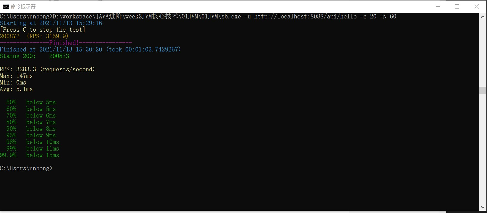

<h3>执行gateway-server </h3>
java -XX:+UseParallelGC -Xmx1g -Xms1g -XX:+PrintGCDetails -XX:+PrintGCDateStamps -XX:-UseAdaptiveSizePolicy -Xloggc:gateway_ParallelGC_1G.log  -jar gateway-server-0.0.1-SNAPSHOT.jar
 
 
<h3>执行SB请求指令</h3>
sb.exe -u http://localhost:8088/api/hello -c 20 -N 60

 

<](SB结果图标.jpg)>