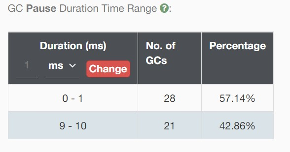
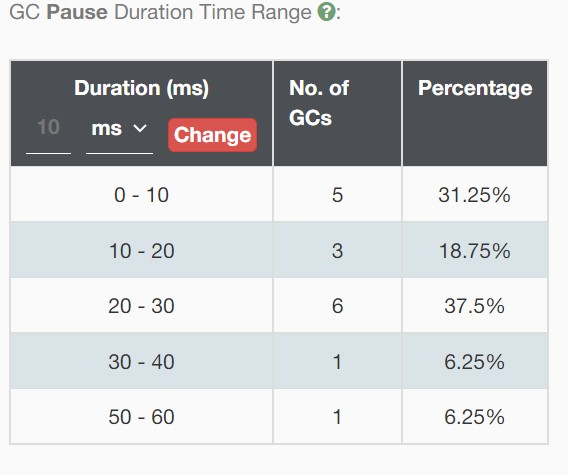
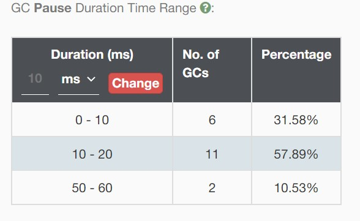
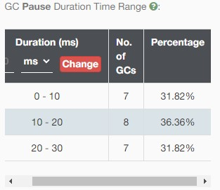

## 不同GC策略的特点

#### 1 GC暂停的时间如下表所示

| GC策略 | 平均 | 最大 |
| ---- |---- |  ---- |
| 串行 | 23.7ms | 50ms |
| 并行 | 20ms | 50ms |
| CMS | 17.3s | 30ms |
| G1 | 4.9ms | 10ms |

> GC暂停时间从高到低的排序串行>并行>CMS>G1

 

#### 2 G1GC的暂停时间的分布比其他策略更加稳定

| G1| 串行 | 并行 | CMS |
| ---- |---- |  ---- |---- |
|<> | <> | <> | <> |

#### 

## 不同堆内存大小对垃圾回收的影响

#### 1 更大堆内存大小使得GC的次数变少，从而降低了整体GC暂停时间。
 

示例 并行GC下的测试结果，在其他GC中也是相同结果
| 内存大小 | 总暂停时间| 次数 | 
| ----| ---- |---- |  
| 1G| 547ms | 4 |  
| 4G|  892 ms | 19 | 

#### 2 更大的内存下单次GC所使用的时间更多
 
示例 并行GC下的测试结果，在其他GC中也是相同结果

| 内存大小 | 平均 | 最大 | 
| ----| ---- |---- |  
| 1G| 20 ms   | 50ms  |  
| 4G|  47.5ms | 60 ms | 

